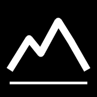

<h1 align="center">
   
  Altitrack
</h1>

  Phone-based elevation-gain tracker. Records how much you climbed, independently
  of Strava, on any smartphone — no app install, no API key, no account.

  <b><a href="https://hazel080.github.io/elevationtrack/">▲ &nbsp;Open the tracker</a></b>

  works worldwide · iOS + Android · nothing leaves the phone

---

## Use it

**[hazel080.github.io/elevationtrack](https://hazel080.github.io/elevationtrack/)** — open
it on the phone, allow location, press **Start**. That is the whole thing; there
is nothing to sign up for.

**Keep it on the home screen** so it opens full-screen with its own icon:

| iPhone | Android |
|---|---|
| Safari → **Share** → *Add to Home Screen* | Chrome → **⋮** → *Add to Home Screen* / *Install app* |

**While recording,** leave the screen on (the app holds a wake lock) and keep the
tab in front. Backgrounded browsers get their GPS throttled or suspended by both
operating systems — that is a platform limit, not a setting.

**Exports.** *Export GPX* gives a file Strava, Garmin Connect and Komoot import
directly. *Export JSON* gives a Strava-activity-shaped payload — same field
names, so it drops into an existing pipeline — plus the raw streams.

### Where it works

Everywhere. Elevation comes from a global terrain model, with two national LiDAR
models used where they exist:

| where | dataset | resolution |
|---|---|---|
| Spain | IGN MDT (PNOA LiDAR) | 5 m |
| Switzerland | swisstopo swissALTI3D | 0.5 m |
| everywhere else | AWS Terrarium (SRTM) | ~30 m |

The national choices are bounding boxes, and every bounding box overhangs its
border — the Spanish one covers Portugal, Andorra and Perpignan; the Swiss one
covers Como, Chamonix and Bregenz. So the choice is *probed* against the real
service on the first fix and falls back to the global tiles where the national
model has no coverage. Only a coverage answer falls back: a slow request must
not downgrade a whole ride in Spain.

## Develop it

    ./serve.sh        # local server + HTTPS tunnel, for testing an unpushed change
    node test.mjs     # the validation suite

`serve.sh` prints an `https://….trycloudflare.com` URL. HTTPS is required —
browsers refuse geolocation otherwise, which is also why the published copy
lives on GitHub Pages. Pushing to `main` republishes it.

## Privacy

There is no backend. The track lives in the phone's `localStorage` and nowhere
else. The only outbound requests are the terrain lookups — a coordinate goes to
AWS, IGN or swisstopo to get a height back. Nothing is ever uploaded, and the
exports are files the phone hands you.

## How it works

Elevation does **not** come from the phone's altimeter. Each GPS fix's lat/lon is
looked up in a terrain model, smoothed, then accumulated with a threshold.

The model is chosen by location (see [Where it works](#where-it-works)), because
national LiDAR beats global SRTM badly. It matters most in cities. SRTM is a *surface* model — it measures rooftops:

| Barcelona | IGN 5 m | SRTM 30 m | actual |
|---|---|---|---|
| Tibidabo | 511.8 m | 512 m | ~512 |
| Montjuïc | 171.7 m | 180 m | ~173 |
| Plaça Catalunya | 21.1 m | 33 m | ~20 |

A track stays on **one** provider start to finish. Two datasets disagree by
metres at the same coordinate, so switching mid-ride would book that
disagreement as real climbing. If the provider fails, the fix is skipped.

This is Strava's own method for activities recorded without a barometer, and it
buys two things:

- **Cross-platform.** Android Chrome returns `null` for GPS altitude, so any
  altitude-based tracker simply does not work there.
- **Saw-toothing is structurally impossible.** The same coordinate always returns
  the same elevation, so GPS noise cannot manufacture metres that were never
  climbed — the fraud that currently needs a human reviewer.

Every fix passes a gate before reaching the math: cold-start settling, a movement
gate at `1.5 × GPS accuracy`, a Doppler-speed gate (`coords.speed` reads ~0 while
standing still even as the position drifts), and a teleport gate at 30 m/s.
On top of the gates, **stationary episodes are removed from the math**: a run of
points that never leaves a 40 m circle for 2 minutes or more is someone resting
while the GPS wanders — nobody gains the 10 m threshold inside 40 m — and only
its last anchoring point survives. It is anchored to where the run started, not
a sliding window: at hike-a-bike pace a hairpin climb never leaves a sliding
40 m window either, and that variant erased the climb. And it is 2 minutes, not
10: drift leaves the circle and starts a new run long before 10 minutes, so a
long minimum collapses nothing.

Without all of this, standing still on a 30% slope for 50 minutes fabricates
~175 m; with it, 0 m in the synthetic test, and 0 on any phone that reports
Doppler speed regardless of terrain. The remaining exposure is a receiver that
drifts more than 40 m while reporting 20 m accuracy on a steep slope.

## Accuracy

After every accepted fix the terrain is also scanned along the line from the
previous fix (every 5 m on tiles, 10 m on the national services), because a
summit is usually *crossed* between two fixes rather than hit by one. The
extremes of that scan feed the accumulator.

Measured on a synthetic 10-lap out-and-back hill: **980 m against a true
1000 m**; on 10 km of 15 m rolling hills, **989 m against 1000 m**; on 30 m
hills with 20 m GPS accuracy, **2933 m against 3000 m** (2753 without the scan).
The out-and-back remainder is the turnaround itself: the last accepted fix is at
most one gate distance short of the top, and no straight-line scan between the
fix before and the fix after can see a point the path did not cross.

Smoothing is used only to decide *when* the track reverses; the amplitude of each
leg is read from the raw terrain value at that extremum. Reading it from the
smoothed series clipped every summit and valley (932 m on the hill test, 903 m on
rolling terrain) — a bias that grew with the number of extrema, so it could not
be calibrated out. Overcounting is an integrity failure, so `test.mjs` enforces
the asymmetry: never above truth, never more than 2.5% below on hills.

## Files

| | |
|---|---|
| `altitude.js` | All the math. Pure — no DOM, no network. |
| `index.html`  | The tracker UI. |
| `test.mjs`    | Validation suite. |
| `serve.sh`    | Local server + HTTPS tunnel. |
| `compare.mjs` | Re-derives a track's gain from 4 terrain datasets and 3 algorithms. |
| `manifest.webmanifest`, `icon-*.png` | Home-screen install. No service worker: every fix needs a live terrain lookup, so an offline shell would only cache a screen that cannot record anything. |

## Validating it — what to compare against

**There is no single true elevation-gain number.** Strava, Garmin and Google all
disagree, because each derives elevation from a different terrain dataset. Run
`compare.mjs` on any track and the disagreement is visible:

    node compare.mjs track.json [--truth 350]

The same 150-point ascent, same algorithm, four independent terrain datasets:

| terrain source | gain |
|---|---|
| mapzen / SRTM | 1275 m |
| eudem25m | 1230 m |
| swisstopo LiDAR 0.5 m | 1311 m |

**6.5% spread from the data alone.** No algorithm can be more consistent than
the terrain data underneath it, so "matches Strava exactly" is not a
reachable target — and not the right one.

### The one reference that is not an estimate

Pick a route that is **one continuous climb** — no rolling, no descent — and take
the surveyed elevation of its start and end points. The difference is the true
gain, and no smoothing or threshold choice can influence it. Then:

1. Walk it once, recording with this app.
2. `node compare.mjs track.json --truth <surveyed delta>`

`compare.mjs` prints the surveyed endpoint difference automatically in Spain and
Switzerland. Elsewhere, use your national mapping agency or trig-point markers.

**Barcelona reference route:** Plaça Espanya → Castell de Montjuïc.
IGN surveys those endpoints at 26.6 m and 184.1 m — a **157.6 m** true climb,
continuous, walkable in about 25 minutes. Measured on that route with the
previous (smoothed-amplitude) accumulator, this app read **155 m: 1.6% low**.
Not yet re-walked with the current one.

Then repeat the same climb 5 times in one recording. True gain is 5x the delta.
That is the test that matters, because it exercises the accumulator the way an
Everesting does.

## Calibration

Six constants in `altitude.js` are the whole tuning surface:
`window = 5` (direction smoothing), `threshold = 10` (metres before a climb
counts), `accFactor = 1.5` (movement gate), `minSpeed = 0.3` m/s (Doppler gate),
`radius = 40` / `minTime = 120` (stationary episode).
Tune against a real ride recorded alongside Strava.

## Not done yet

Barometer (unreachable from a browser on both platforms — needs a native shell
wrapping this same `altitude.js`), watch support, backend.
